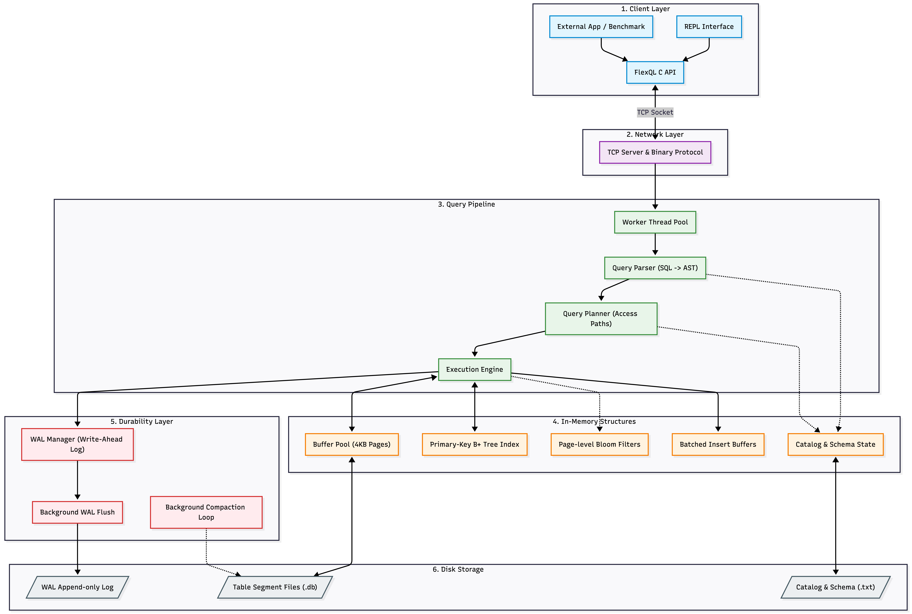

# FlexQL

## 1. What
FlexQL is a high-performance SQL-like database engine in C++ with a client-server architecture.

It supports:
- `CREATE TABLE`
- `INSERT`
- `SELECT` (all columns or projected columns)
- `WHERE` with operators: `=`, `>`, `<`, `>=`, `<=`
- `INNER JOIN`

Key engine components include:
- Disk-based paged storage (`4KB` pages)
- Buffer pool with caching and eviction
- B+ Tree primary-key index
- WAL (Write-Ahead Logging) with group commit
- Multithreaded TCP server
- C API client (`flexql_open`, `flexql_exec`, `flexql_close`, `flexql_free`)

### Architecture Diagram


---

## 2. Folder Structure
```text
FlexQL/
├── include/
│   ├── flexql.h
│   └── flexql/
│       ├── core_types.hpp
│       ├── storage_engine.hpp
│       ├── buffer_pool.hpp
│       ├── bplus_tree.hpp
│       ├── query_parser.hpp
│       ├── query_planner.hpp
│       ├── execution_engine.hpp
│       ├── wal_manager.hpp
│       ├── tcp_server.hpp
│       └── ...
├── src/
│   ├── core_types.cpp
│   ├── storage_engine.cpp
│   ├── buffer_pool.cpp
│   ├── bplus_tree.cpp
│   ├── query_parser.cpp
│   ├── query_planner.cpp
│   ├── execution_engine.cpp
│   ├── wal_manager.cpp
│   ├── tcp_server.cpp
│   ├── flexql_c_api.cpp
│   ├── flexql_server_main.cpp
│   └── flexql_repl_main.cpp
├── benchmark_suite/
│   └── benchmark_flexql.cpp
├── data/
├── Makefile
└── README.md
```

---

## 3. Compilation and Execution Instructions

### Prerequisites
- C++17 compiler (`g++` or `clang++`)
- `make`
- POSIX environment (Linux/macOS)
- Optional for REPL: `readline` library

### Build
```bash
make clear
make -j4 server repl benchmark
```

### Run Server
```bash
make run-server PORT=9000
```

### Run REPL
```bash
make run-repl HOST=127.0.0.1 PORT=9000
```

### Run Benchmark
```bash
make run-benchmark ROWS=200000 CLIENTS=4
```

### Run 10M Benchmark
```bash
make run-benchmark ROWS=10000000 CLIENTS=4
```

### Unit Tests from Benchmark Harness
```bash
make run-benchmark-unit
```

---

## 4. Performance Results for Large Datasets

Representative run (10M rows, 4 clients):

- Insert benchmark:
  - Rows inserted: `10,000,000`
  - Elapsed: `4,742 ms`
  - Throughput: `2,108,814 rows/sec`

- Multi-client SELECT benchmark (full table scan):
  - Clients: `4`
  - Total rows returned: `40,000,000`
  - Elapsed: `18,319 ms`

- Multi-client WHERE benchmark (primary key equality):
  - Clients: `4`
  - Total rows returned: `4`
  - Elapsed: `3,697 ms`

Notes:
- Results may vary by CPU, disk speed, OS, and background system load.
- For reproducibility, run on a clean `data/` directory and fixed client/row settings.
